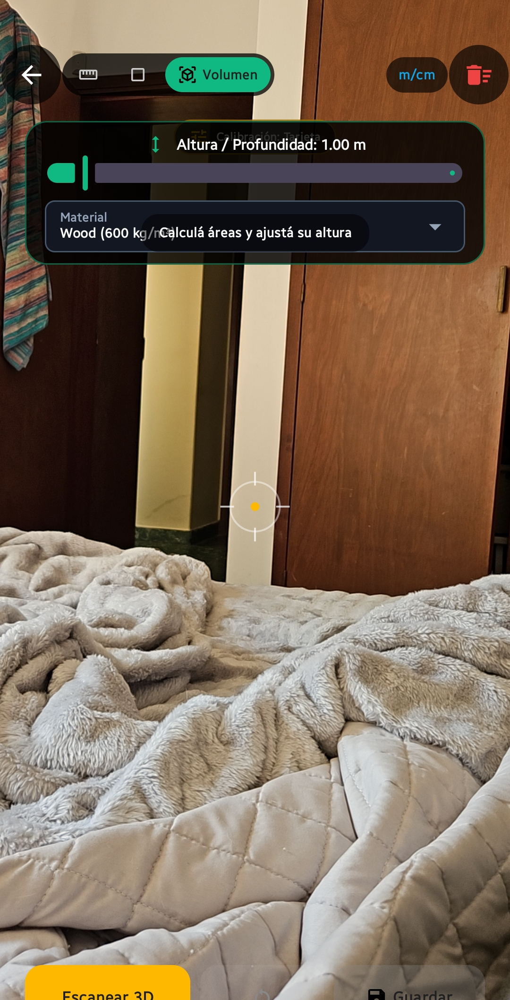
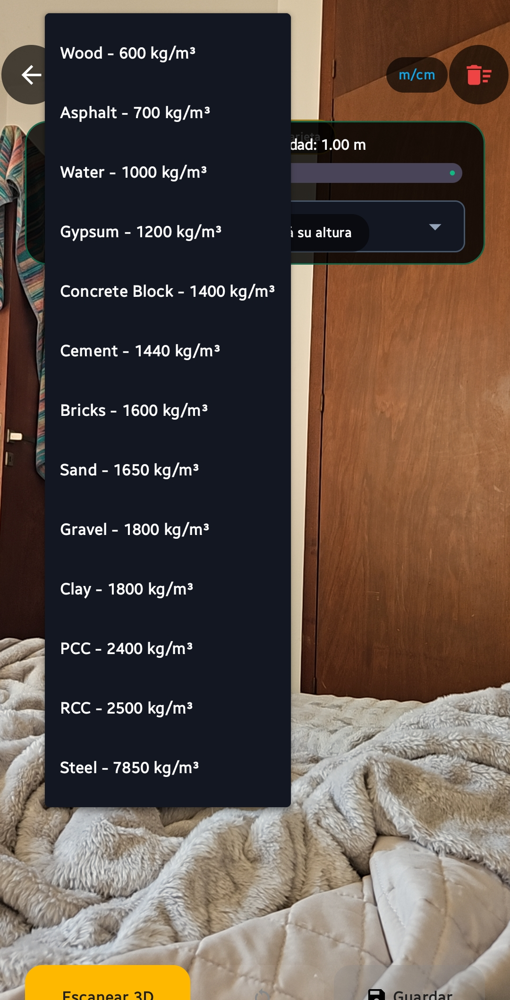

# Metrax

**Sistema de medición AR para obra e ingeniería** — distancias, superficies y volúmenes en tiempo real usando la cámara del celular (ARCore), con historial, exportación de reportes y soporte multi-idioma.

<p align="center">
  
  
</p>

> Las dos capturas de arriba son del dispositivo real (Android, cámara AR activa). El repo trae otros tres archivos en `docs/screenshots/` (`home.jpg`, `ar_measure.jpg`, `history.jpg`) que llegaron corruptos — bytes reemplazados por el carácter UTF-8 inválido `U+FFFD`, típico de un commit que pasó binario por una tubería de texto. Hay que volver a subirlos.

---

## Qué hace

Apuntás la cámara del celular a una superficie u objeto y la app usa detección de planos y profundidad de ARCore para calcular medidas reales en el mundo físico, sin cinta métrica.

### Los 3 modos de medición

| Modo | Cómo se usa | Qué calcula |
|---|---|---|
| **Distancia** | Tocás 2+ puntos en pantalla (o el botón "Añadir Punto" con la mira central) | Suma la distancia 3D entre puntos consecutivos |
| **Área** | Tocás 3+ puntos delimitando un polígono | Área de la superficie (algoritmo de Newell sobre el polígono 3D); al llegar a 3+ puntos la superficie se cierra visualmente (línea del último punto al primero) |
| **Escaneo 3D / Nube** | Apretás "Escanear", la app arma una nube de puntos LiDAR-style mientras movés el teléfono alrededor del objeto | Bounding box 3D (ancho × alto × profundidad) a partir de la nube capturada por `Frame.acquirePointCloud()` de ARCore → volumen, y estimación de masa según el material seleccionado |

### Calibración de escala

Como la cámara sola no conoce el tamaño real del mundo, hay un sistema de calibración: elegís un objeto de referencia conocido en escena (tarjeta de crédito 8.56cm, hoja A4, regla de 1m, o una medida personalizada) y marcás sus dos extremos — la app recalcula el factor de escala (`scaleFactor`) contra ese patrón y lo aplica a todas las mediciones siguientes.

### Materiales y masa estimada

En Escaneo 3D podés elegir un material (Madera, Hormigón, Arena, Acero, etc., cada uno con su densidad en kg/m³) para que, además del volumen, la app calcule la masa estimada del acopio o pieza escaneada.

### Historial y exportación

Cada medición guardada queda en un historial local (Room/SQLite), filtrable por tipo y buscable por título. Desde ahí se puede exportar a:
- **CSV** (planillas de cálculo)
- **JSON** (datos crudos)
- **Markdown** (tablas para informes/chat)
- **Reporte HTML** con gráficos SVG embebidos
- **Gráfico SVG** standalone (barras comparativas)

Todo se comparte vía el selector nativo de Android (`Intent.ACTION_SEND`) o se copia al portapapeles.

### Multi-idioma

Español, Inglés y Portugués, seleccionable desde Ajustes → cambia todos los textos de la app en vivo (`LanguageManager` + `CompositionLocal` de Compose, sin reiniciar la app).

### Cuenta / sesión

Login y registro con validación de email/contraseña y medidor de fortaleza de contraseña — la autenticación es **simulada localmente** (no hay backend real detrás, guarda la sesión en `SharedPreferences`). También se puede usar como invitado sin cuenta.

---

## Cómo está armado por dentro

```
app/src/main/java/com/example/
├── MainActivity.kt                    punto de entrada, monta el NavHost de Compose
├── data/
│   ├── model/                         Point3D, PointCloudPoint, BoundingBox3D, enums de modo/plano/calibración
│   ├── db/                            Room: MeasurementEntity, MeasurementDao, AppDatabase
│   └── repository/                    MeasurementRepository (wrapper sobre el DAO)
├── ui/
│   ├── screens/                       Welcome, Login, Register, Home, Measure, History, Settings
│   ├── components/                    PointCloudViewer3D, ScanGuidanceOverlay, ExportDialog, AuthComponents
│   ├── viewmodel/                     MeasurementViewModel (estado + cálculos), AuthViewModel
│   └── theme/                         paleta de color / tipografía Material3
└── util/
    ├── GeometryUtils.kt               distancia 3D, área de polígono, bounding box, formateo de unidades
    ├── LanguageManager.kt             AppStrings (ES/EN/PT) + persistencia del idioma elegido
    ├── ExportManager.kt               generación de CSV/JSON/Markdown/HTML/SVG
    └── ScaleManager / UnitConverter   utilidades de escala y conversión de unidades
```

La pantalla de medición (`MeasureScreen.kt`) monta un `ARSceneView` (librería [SceneView](https://github.com/SceneView/sceneview-android) sobre ARCore) como capa de cámara, y dibuja overlays 2D (Compose `Canvas`) encima: mira central, puntos marcados, líneas de medición, badges de distancia en vivo, todo proyectado de coordenadas 3D del mundo a coordenadas de pantalla usando la matriz vista/proyección de la cámara AR en cada frame.

---

## Stack técnico

- **Kotlin** 2.2.10 + **Jetpack Compose** (Material3, BOM 2024.09.00)
- **ARCore** vía **SceneView** 2.0.2 (detección de planos, point cloud, estimación de luz HDR)
- **Room** 2.7.0 (persistencia del historial)
- **Navigation Compose** 2.8.9
- **Retrofit + Moshi + OkHttp** (preparado para backend, no usado activamente todavía)
- **Firebase** (Auth, Firestore, AppCheck, AI) — dependencias incluidas pero sin `google-services.json`, quedan en modo `WARN` (no rompen el build, tampoco están activas)
- **KSP** para el procesamiento de anotaciones (Room)
- Tests: **JUnit4** + **Robolectric** + **Roborazzi** (screenshot testing)

**Android:** `minSdk 24`, `targetSdk/compileSdk 36`, `applicationId com.aistudio.metrajeinstante.m7a2b9`

---

## Permisos

| Permiso | Para qué |
|---|---|
| `CAMERA` | Requerido por ARCore para ver la escena y hacer tracking |
| `android.hardware.camera.ar` (feature required) | El dispositivo debe soportar ARCore — no instala en celus sin esa feature |

---

## Compilar desde cero

El repo **no incluye el wrapper de Gradle** (`gradlew`/`gradle-wrapper.properties`), así que hace falta Gradle instalado aparte.

**Necesitás:**
- JDK 21 (Gradle 9.x + AGP 9.1.1 lo piden)
- Gradle 9.3.1 o superior (AGP 9.1.1 exige mínimo 9.3.1)
- Android SDK con `platform-36.1`, `build-tools 36.0.0`

```bash
# apuntar al SDK
echo "sdk.dir=/ruta/a/Android/Sdk" > local.properties

# debug build necesita un keystore de debug (no versionado)
keytool -genkeypair -v -keystore debug.keystore -storepass android \
  -alias androiddebugkey -keypass android -keyalg RSA -keysize 2048 \
  -validity 10950 -dname "CN=Android Debug,O=Android,C=US"

gradle assembleDebug
```

El APK queda en `app/build/outputs/apk/debug/app-debug.apk`.

Para build de **release** hace falta además `my-upload-key.jks` (o las env vars `KEYSTORE_PATH`, `STORE_PASSWORD`, `KEY_PASSWORD`) — ver `app/build.gradle.kts`, bloque `signingConfigs`.

---

## Limitaciones conocidas

- El volumen del Escaneo 3D usa un **bounding box alineado a los ejes** sobre la nube de puntos — no compensa si la superficie está inclinada; para pilas sobre terreno irregular puede sobreestimar el volumen.
- Sin un dispositivo físico con ARCore no hay forma de probar el flujo de escaneo — no existe cobertura de emulador para esta parte.
- La autenticación es 100% local/simulada, no hay backend de verdad detrás del login.
